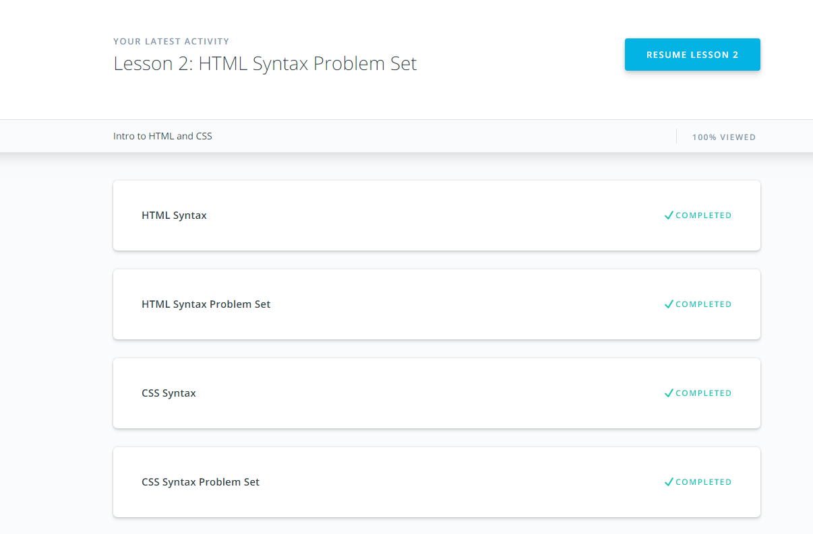
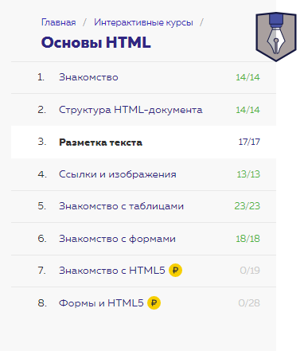
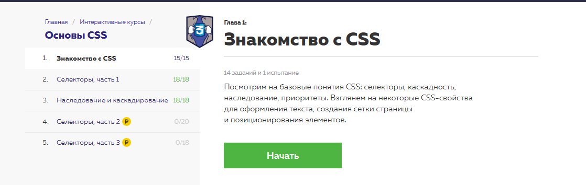
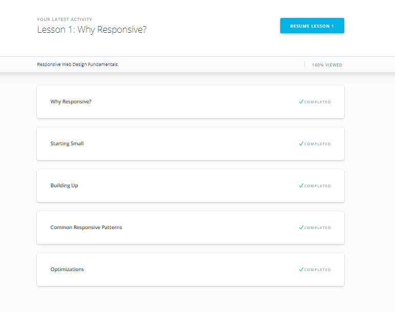
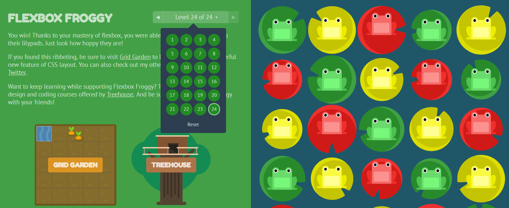

# kottans-frontend - my course progress git

# Stage 0:

## Task 0. Git and GitHub:
### 
"How to use Git and GitHub" course from Udacity was interesting and give new knowledge to me. Sarah and Carolyn explained basic ideas of Git and GitHub. Content map was really useful, but I am still has some questions about merge conflicts. I will continue study Git because to me really interesting learn something about using Git in real projects.  And one more - I want share this course:

###### [Git How To](https://githowto.com/ru)

## Task 1: Learn the Command Line.

## Task 2: Git for Team Collaboration.

## Task 3: Intro to HTML and CSS.

## Task 4: Responsive Web Designs

